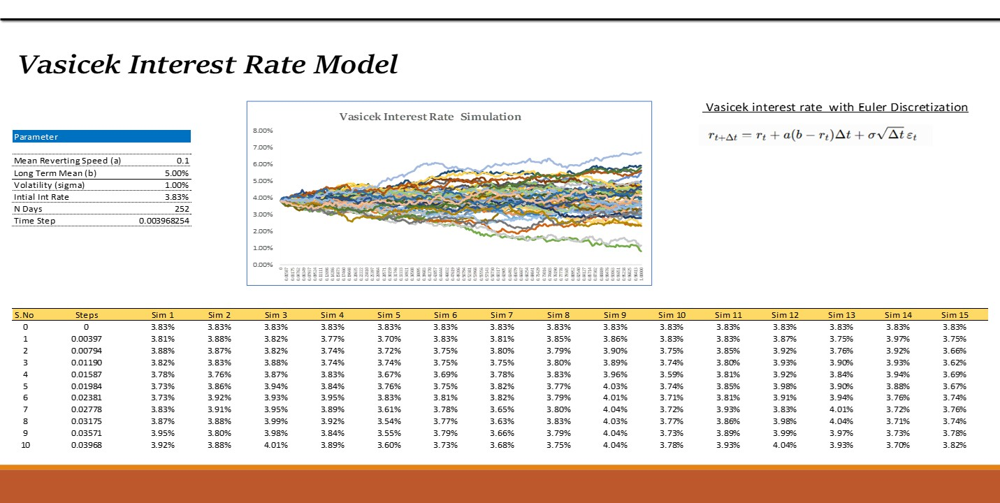
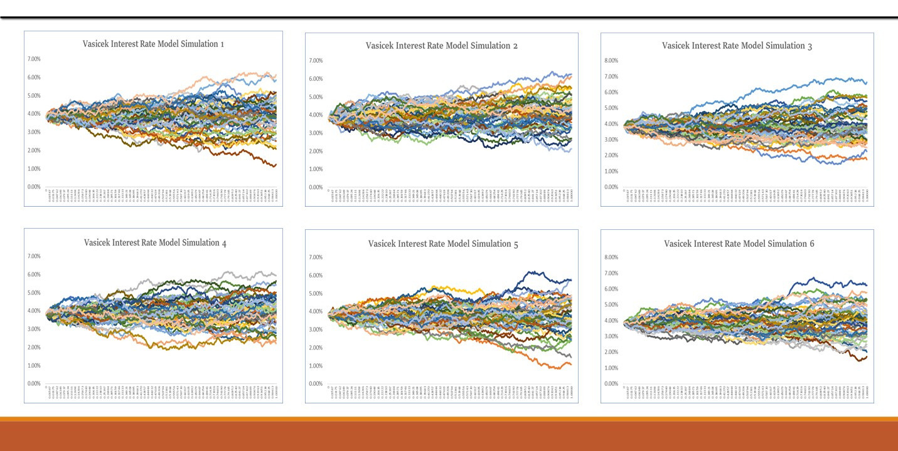
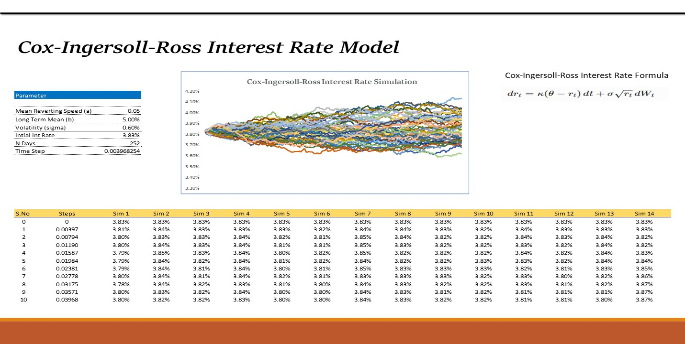
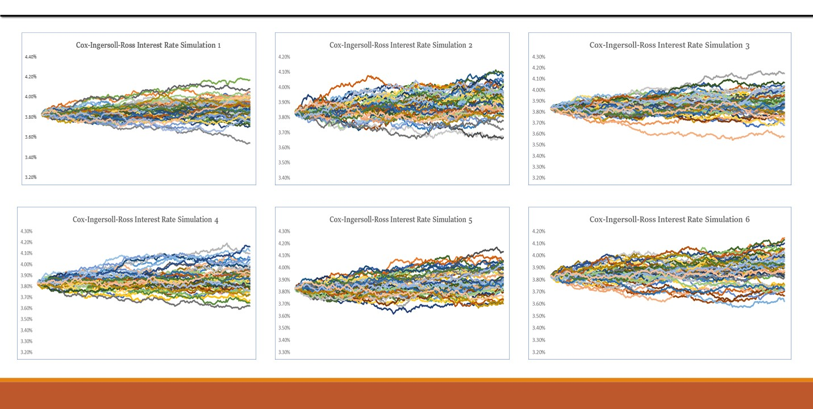

# Interest Rate Models: Vasicek and Cox-Ingersoll-Ross (CIR)

## 📌 Project Overview

This project demonstrates the simulation of short-term interest rates using two widely used stochastic interest rate models:

- **Vasicek Interest Rate Model**
- **Cox-Ingersoll-Ross (CIR) Interest Rate Model**

The models are implemented in **Microsoft Excel** to simulate multiple possible interest-rate paths and visualize how interest rates can evolve over time.

This project combines concepts from **quantitative finance, fixed-income analytics, stochastic processes, and Monte Carlo simulation**.

---

## 📊 Project Preview

### Vasicek Interest Rate Model

The Vasicek model uses mean reversion to simulate the movement of short-term interest rates.



### Vasicek Simulation Paths

Multiple interest-rate paths are generated using the Vasicek model.



---

### Cox-Ingersoll-Ross (CIR) Model

The CIR model introduces a square-root term into the volatility component.



### CIR Simulation Paths

Multiple simulated interest-rate paths generated using the CIR model.



---

## 📥 Excel Model

The complete Excel workbook containing the model calculations, simulation tables, parameters, and charts is available here:

👉 **[Download the Excel Interest Rate Model](Excel/Interest_Rate_Models.xlsx)**

The workbook contains:

- Model parameters
- Vasicek simulation
- CIR simulation
- Euler discretization
- Multiple simulation paths
- Interest-rate tables
- Charts and visualizations

---

# 📐 Models Used

## 1. Vasicek Interest Rate Model

The Vasicek model is represented by:

$$
dr_t = a(b-r_t)dt + \sigma dW_t
$$

Where:

| Parameter | Meaning |
|---|---|
| $r_t$ | Current short-term interest rate |
| $a$ | Mean-reversion speed |
| $b$ | Long-term mean interest rate |
| $\sigma$ | Interest-rate volatility |
| $dW_t$ | Wiener process |

The key idea is **mean reversion**: interest rates tend to move toward a long-term average.

---

## 2. Cox-Ingersoll-Ross (CIR) Model

The CIR model is represented by:

$$
dr_t = \kappa(\theta-r_t)dt+\sigma\sqrt{r_t}dW_t
$$

Where:

| Parameter | Meaning |
|---|---|
| $r_t$ | Current short-term interest rate |
| $\kappa$ | Mean-reversion speed |
| $\theta$ | Long-term mean interest rate |
| $\sigma$ | Volatility |
| $dW_t$ | Wiener process |

The important difference is the **$\sqrt{r_t}$** term in the volatility component.

---

# 🧮 Simulation Method

The Vasicek model is simulated using Euler discretization:

$$
r_{t+\Delta t}
=
r_t+a(b-r_t)\Delta t
+
\sigma\sqrt{\Delta t}\epsilon_t
$$

Where:

- $\Delta t$ = time step
- $\epsilon_t$ = standard normal random variable
- $a(b-r_t)$ = mean-reversion component
- $\sigma\sqrt{\Delta t}\epsilon_t$ = random shock

Multiple paths are generated to demonstrate possible future interest-rate movements.

---

# ⚙️ Model Parameters

### Vasicek

| Parameter | Value |
|---|---:|
| Mean Reversion Speed | 0.10 |
| Long-Term Mean | 5.00% |
| Volatility | 1.00% |
| Initial Interest Rate | 3.83% |
| Number of Days | 252 |
| Time Step | 0.003968254 |

### CIR

| Parameter | Value |
|---|---:|
| Mean Reversion Speed | 0.05 |
| Long-Term Mean | 5.00% |
| Volatility | 0.60% |
| Initial Interest Rate | 3.83% |
| Number of Days | 252 |
| Time Step | 0.003968254 |

---

# 🔎 Key Observations

### Vasicek Model

- Interest rates tend to revert toward the long-term mean.
- Random shocks create different possible interest-rate paths.
- The model does not strictly prevent interest rates from becoming negative.

### CIR Model

- The volatility depends on the current interest-rate level.
- The model uses the square-root term $\sqrt{r_t}$.
- This produces different simulated dynamics compared with the Vasicek model.

---

# 📊 Excel Implementation

The Excel workbook includes:

1. Model parameter inputs
2. Initial interest-rate calculation
3. Time-step calculation
4. Random shock generation
5. Euler discretization
6. Multiple simulation paths
7. Simulation tables
8. Interest-rate charts
9. Vasicek model simulation
10. CIR model simulation

---

# 🛠️ Tools & Concepts

### Tools

- Microsoft Excel

### Quantitative Finance Concepts

- Interest Rate Modeling
- Fixed Income Analytics
- Stochastic Processes
- Mean Reversion
- Monte Carlo Simulation
- Euler Discretization
- Short-Rate Models
- Interest Rate Simulation

---

# 🎯 Learning Outcomes

Through this project, I explored:

- How stochastic interest-rate models work
- How mean reversion affects interest rates
- How to simulate interest-rate paths
- How Euler discretization converts a continuous-time model into a discrete simulation
- How Monte Carlo simulation can generate multiple possible scenarios
- Differences between Vasicek and CIR models
- Implementation of quantitative finance models in Excel

---

# 📁 Project Structure

```text
interest-rate-models-vasicek-cir/
│
├── README.md
│
├── Excel/
│   └── Interest_Rate_Models.xlsx
│
├── Screenshots/
│   ├── Vasicek_Model.png
│   ├── Vasicek_Simulations.png
│   ├── CIR_Model.png
│   └── CIR_Simulations.png
│
└── Documentation/
    └── Interest_Rate_Model_Notes.pdf
